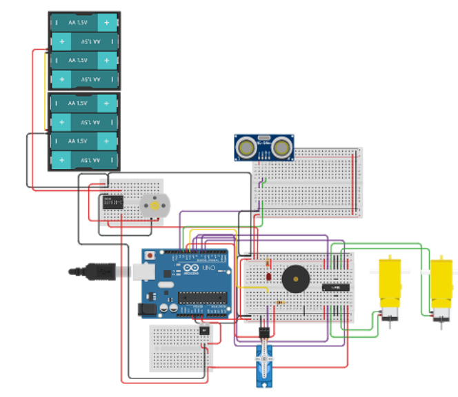

# [aYUdaNTé](https://www.tinkercad.com/things/9JCeAIEu0vn)
A smart vacuum built online in [tinkercad](https://www.tinkercad.com) for RoboSInC Malaysia 2021

</img>

## Concept
Just a naiive simple obstacle avoidance algorithm.
The implementation is in the [Main file](main.ino)